# How it is started

Several days a go I was on the camp site with friends. I was used to autonomous style hiking in Alps, where you limited to the weight you can carry, so the food is very basic. On the camp site you come with the car (or friends car) and can carry much more with you and allow much bette food ration. I like fresh milk products a lot, grilling fish and meat on the nature is also a great delight. I started using a 8l cool box from Decathlong with two 1,5l frozen bottles. I liked it a lot - now I can take my jogurts, quark, fresh fruits and even meat. Previously it all get trashed, sometimes even during the ride to the campsite, e.g. in Austria, after 4h ride. Now it stayed fresh for 1.5 days! And the enjoyment from staying on nature increased a lot, because you have good healthy food with you. But one day I had to stay longer than 2 days, the frozen water in bottles has melted and the fruits and meat get spoiled. That‘s a pity! It smells, it is inconvenient, because you rely that you have some food with you, but instead you have to look for the shops in the time, where you just wanted to eat.

I noticed that many of my friends are using cool boxes, which are connected to electricity. I was not experienced that time in such campaign equipment, so I‘ve start asking. The idea of having a fridge on the campsite amazed me: no longer playing lottery with frozen bottles, no more smelly wasted food in the cooling compartment, delicious healthy food is always with you. Isn’t that cool?

I‘ve started asking, checking forums and found out there are two systems (okey there is also one „absorbing“ cooling system, which can also operate from gas, but since I don‘t carry large gas balloons with me I discarded this idea): thermoelectric and compressor. The first I met already in hotels - it is really absolutely quiet. It is a semiconductor plate, which get’s cold on one side and hot on the other side, when the current is applied to it. The second - is a typical fridge system with a circulating coolant, which compressed to liquid, transported to a radiator and evaporated their, acting as a heat pump.

100% of my friends had thermoelectric devices. Those devices were also affordable (some under $100), of convenient size and with handy carry handle. So, it was obviously a best choice, considering that a lot of other campers were using them too.

But I was a bit unsure after I read some forums, where experienced campers exchanged on ideal cooler for the campsite. Many of them complained that thermoelectric devices were too weak to cool down food or beverages on the warm day if they were warm and placed into compartment in the reasonable time. Some complained that the thermoelectric system cannot maintain temperature different over 15 degrees below the ambient temperature. Remembering that we had weeks of over +35 °C and up to +40, I was worried that +20°C may be not enough for the fish stake (recommended to keep +2°C or below).

I also read that many were happy moving to compressor coolers, since they were not dependent on the ambient temperature, even the devices were more expensive. Some warned about the noice of the compressor systems.

I was very unsure which device to choose. I didn’t want to have a compromise on function, since I still remembered the smell of spoiled meat from the last trip. Since I could not decide based on “theoretical research” and didn’t have time to read all those sources, I decided to find out experimentally what is the best cooler for me. The next camping time approached fast, so I ordered both devices to check their function directly (at home).

These were:
-  Mobicool MCF40 Compressor Cooler
- Campingaz Powerbox Plus Thermoelectric 12 V/230 V Cool Box, 24 liter

My task was to find out: which is the best to me?

## Devices

### Campingaz Powerbox Plus Thermoelectric 12 V/230 V Cool Box, 24 liter

From Amazon [1] description:

- Very quiet, powerful electric cool box can be operated either via the normal 230 V socket or the 12 V connection of a vehicle
- Efficient insulation: with PU full foam core filling, tight-fitting lid with recessed grip for easy opening; cooling capacity up to 18° below ambient temperature
- Large capacity: 24 litre capacity for food and drinks, 1.5 litre bottles can be stored standing
- Stable, movable handle; ultra-quiet fan (36 dB); power control by adjusting dial with 4 modes: off, night mode, eco mode, max mode; energy efficiency class A++

Look:
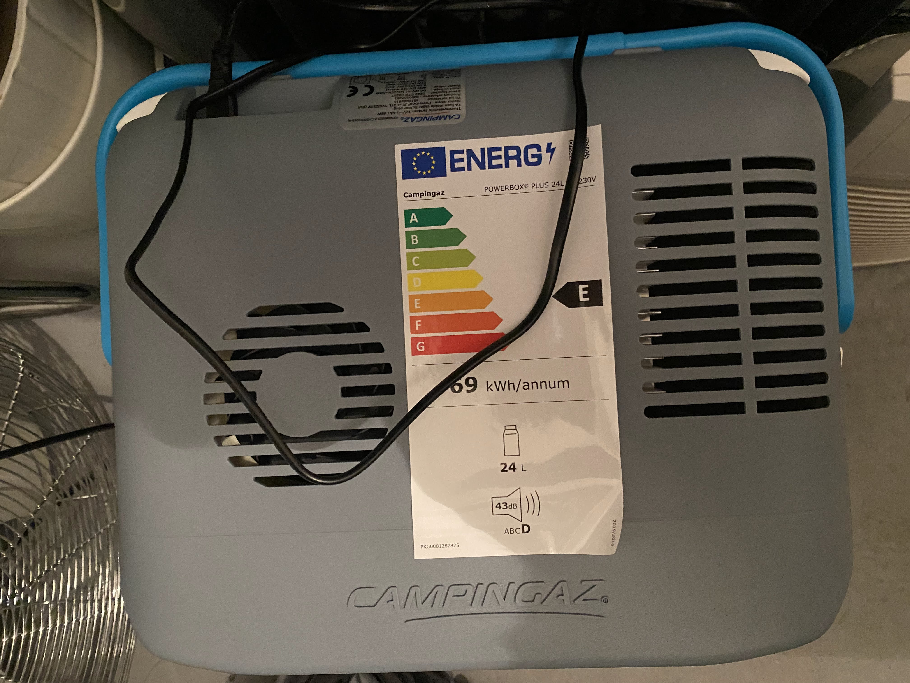

Spec label:
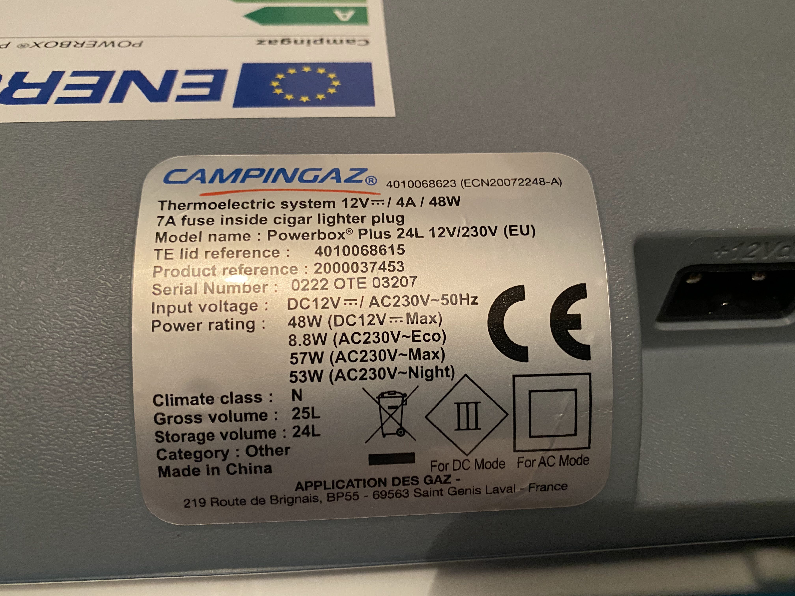

### Mobicool MCF40 Electric Compressor Mini Fridge 32l

From Amazon [2] description:

- Continuous temperature adjustment from +10°C to -10°C, digital display
- 31 litre volume, space for upright 1 litre bottles
- Electric cool box for 12 V DC, 24 V DC and 230 V AC connection

# First impressions

## Mobicool MCF40

Mobicool MCF40 device came first. It was heavy, almost 3 time more expansive than its thermoelectric counterpart. It bulky and has two handles, which is only convenient to carry if you have two people. It was not quiet too. I was not amazed with it first and was looking for the thermoelectric unit.

I put it at the distance from my tent, because I afraid it would disturb my sleep with the frequent start/stop cycles.

I’ve noticed however that it has not problem to keep the set temperature (e.g. 5°C) and maintained it very precisely.
Putting it a couple of meters from the tent also solved the noise issue.

I was still hoping for better from the thermoelectic unit.

It did its job perfectly - fresh meat, fish, ice cream  - all was no problem, even under straight sunshine at the camp site (+30°C).
A friend of mine safely stored his insulin injection dose in it too. I could see later on the monitoring that the temperature in the cooling compartment were very constant.

## Campinggaz Powerbox Plus Thermoelectric

It was so light comparing to compressor box and the handle was so convenient, that I liked it a lot at the first sight. The noise after I plugged it was much less nice then from the compressor unit. It was a higher pitch, louder noise. Nothing has happened for hours after I put room temperature water bottles inside. And I realized the noise (in contrary to the compressor unit) never stops. It just permanently on (on max and night more). Night more is a bit less loud, but still annoying. I realized there is no temp regulation. And 12 hours of working didn’t move temperature below +7°C. I was a bit disappointed with that and want to quantify my feelings with the proper experiment.

# Experiment

## Setup

To quantify my feelings decided to measure a cooling efficiently, energy efficiently and noise levels.

### Cooling efficiency

To measure cooling efficiency I put two bottles of 1.5l water by the room temperature (+25°C) into pre-cooled unit (so it was 3 liters of water).

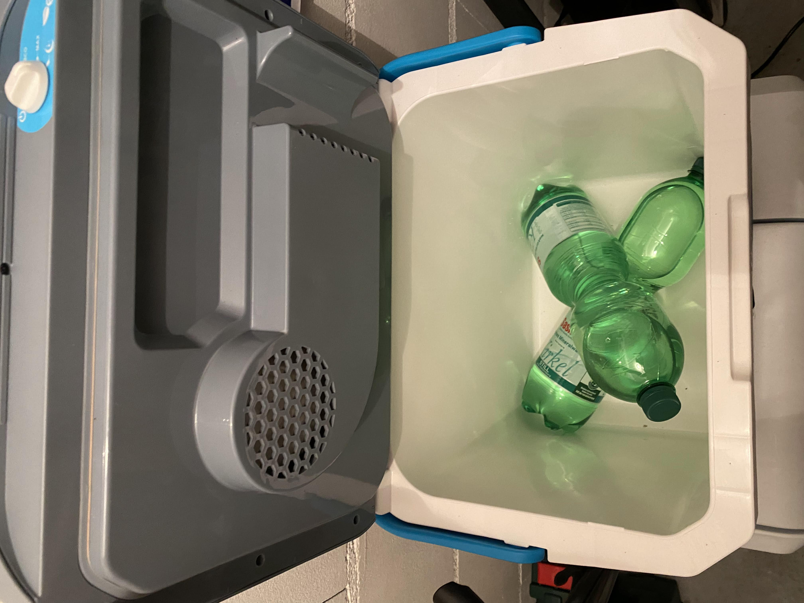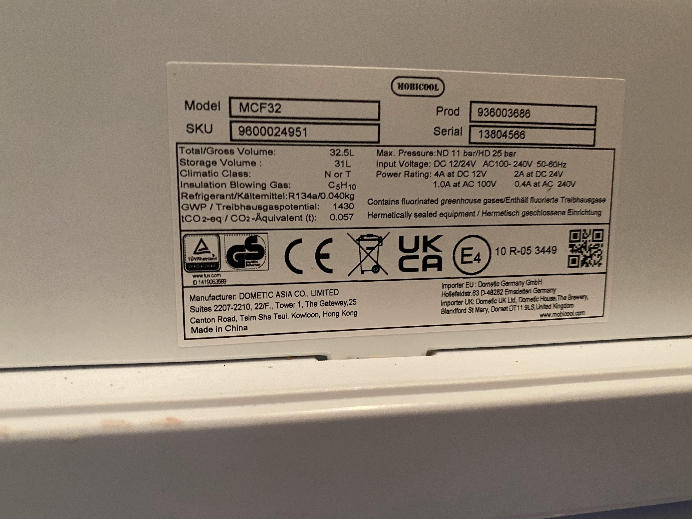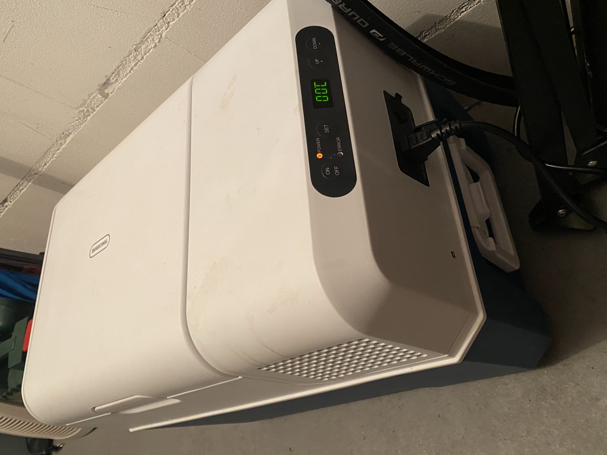

I didn’t set a goal to synchronize the starting conditions of the both units. I just waited until the temperature in each each unit start declining and measured the velocity of such decline in the steepest part of the curve, or basically time the temperature needed to decrease by 5°C. That’s roughly correct, because you need the same amount of energy to cool a liter of water from t1 to t2, independent of absolute values. Since the sensor is located directly on the bottle of water and has very little own inertia and given the slowness of the process, we can roughly say it measure the temperature of the water in the battle and nothing else. So, we’ve measured the power of the heat pump applied to 3l of water.

Thermoelectric showed very limited range of temperatures it can maintain. The decline of the temperature faded out at +7°C by 12 hours, where the compressor unit happily moved it down to configured +5°C (and could go further without problems, as I tested with the ice cream on the camp site next week).

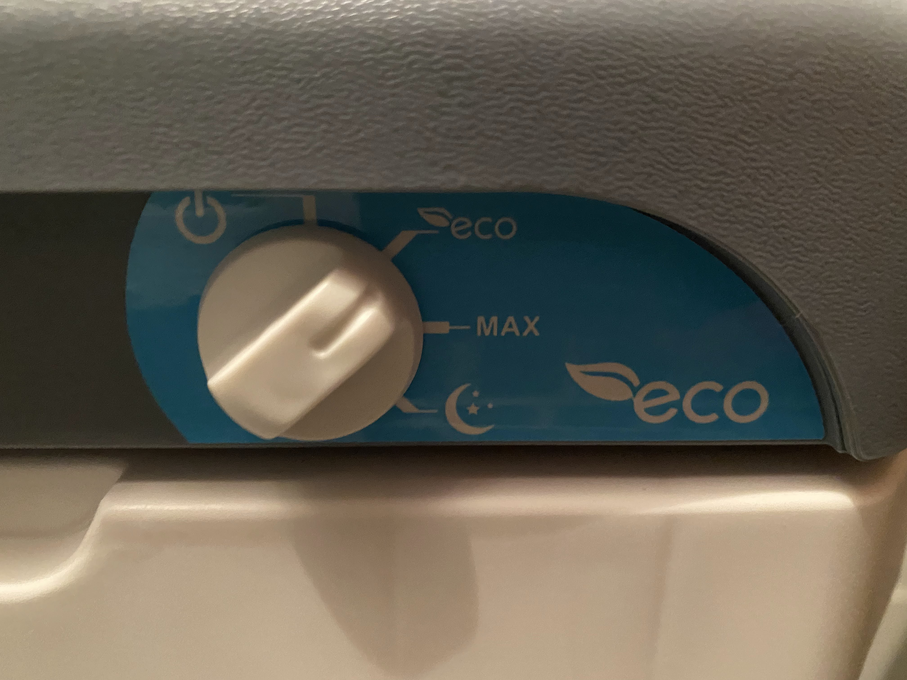

Another fact, which I found quit important was that the compressor unit was working only 20% of time. I assume that the cooling speed can be much higher if I would set a lower target temperature (e.g. -10°C). The unit was just trying not to overcool and were working in on/off mode with the duty cycle of about 1:4 (changing from 1:1 to 1:6 over the measurement time).

### Energy efficiency

Another fact, which amazed me a lot was the difference in the energy efficiency between compressor and thermoelectric unit. The latter was always on was not cooling a lot, but consuming continuously 50W. Even in supposed to be a quit night mode, it was 48W. Probably, only the speed of fans were reduced, but the semiconductor current stayed the same to compensate the heat exchange deficits from the low rotating fans.

Compressor unit was using 42-38W with much higher and much wider range of temperatures. But this 42W was only consumed during the duty cycle, which was 1:5 or lower. So, it consumed much less energy! Effectively 10W per hour (4x less then the thermoelectric unit).

I don’t have large fridge in my apartment and it is not specially cool, so I decided to use the camping cooler as a second fridge in the basement. I realized that thermoelectric unit is absolute no go for that: 

Given the increased electricity costs in EU (0,40EUR/kWh) it would cost 172EUR/year given 24h operation. Compressor unit would cost just 35EUR/year.
I also doubt the thermoelectric unit would also survive the permanent power-on mode, because its both fans (external and internal) are always on, 24h. And that’s another point.

### Noise level
  
Even I didn’t like compressor unit noise at the beginning, I reconsidered it after I switched on the thermoelectric unit. It was considerable louder and much less pleasant because of the higher pitch. And because of already discussed “always on mode” it would annoy constantly.

Being fair, there is an “eco” mode on the thermoelectric unit, but works as a one-temperature set level, but it does not produces good results. At +25C ambient temperature the thermoelectric box over longer time (8h+) produced waves of +9°C..+14°C, which is way to bad for my fresh fish/meat use-case.

Compressor unit noises at 330Hz with 42dB
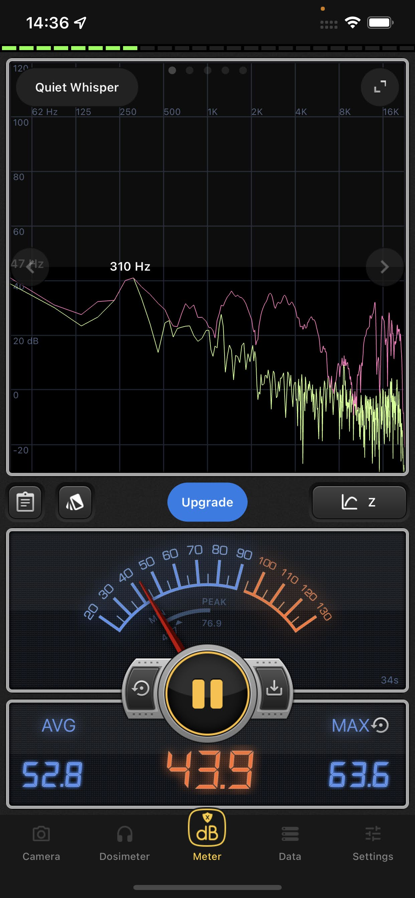

Thermoelectric in eco mode runs with 52dB with much higher and less pleasant pitch of 800Hz:
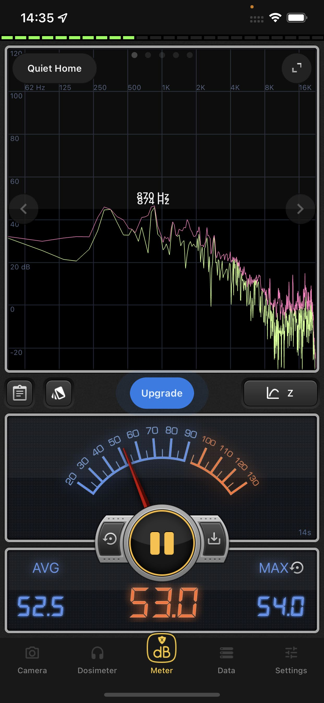

And:
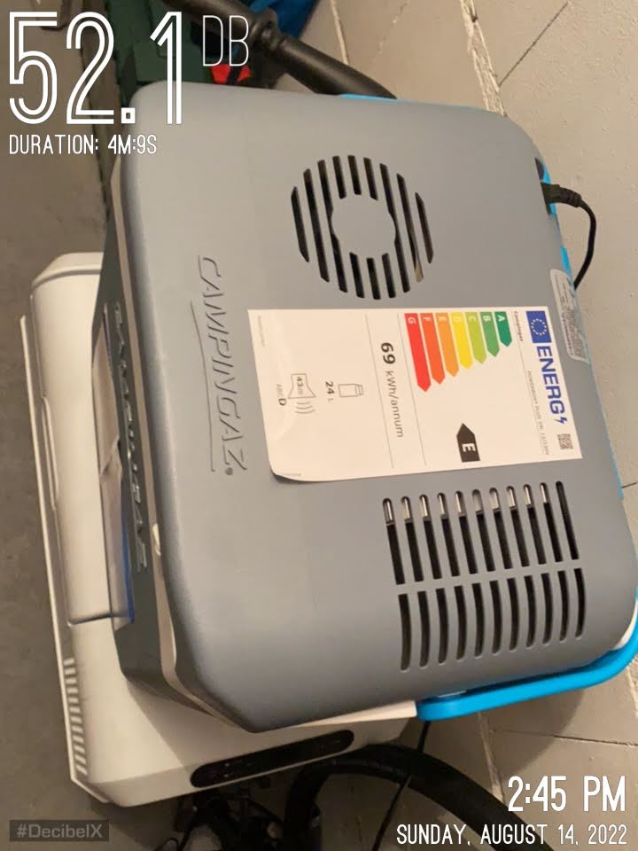

## Measurement details.

### Temperature measurement

For temperature measurement I’ve took [Aqara temperature sensor](https://www.aqara.com/us/temperature_humidity_sensor.html) for its preciseness (0.3°C according to manufacturer) and low inertion. Sensor polls data frequently (at least every 10 seconds) and sends the update if the value has changed above the threashold.

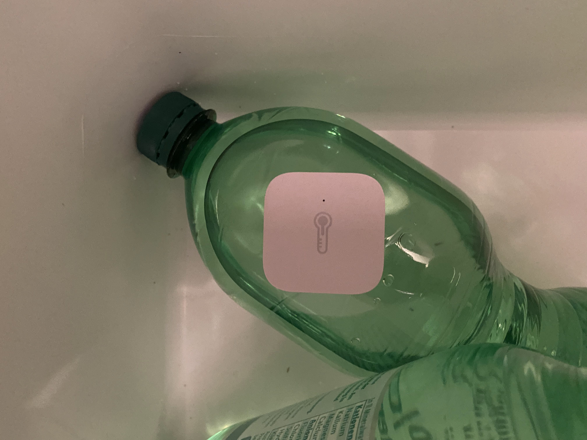

I placed the sensor on the bottle directly, so it does not touch the might be warmer (in case of thermoelectric unit) or colder (in case of the compressor unit) walls.

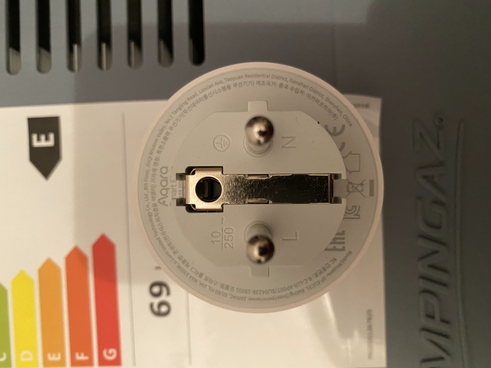

### Power measurement

For power measurement I’ve took [Aqara Smart Plug](https://www.aqara.com/eu/smart_outlet.html). It has accumulating, increasing counter for energy use and momentary power consumption sensort. Poll times upto 1s (1HZ) if the measured value change comes other the threashold. All sample data were recorded.

### Noise level measurement

Noise levels I measured directly from 1 meter distant from the working unit.
I took app DecibelX v.9.5.0 running on my iPhone 11 Pro Max iOS 15.6.

# Conclusion

As you would guess if you read the previous text, I stayed with compressor box. Nor the 3x cheaper price, a 2.5x times lower weight, less bulky design, convenient handle can compensate to low cooling efficiency. You can by 3 such units for the price of the compressor, but all three won’t help you keep you food fresh. Nor you can sleep conveniently next to such noise generator. Vocation on the nature is something different, right? 

I have to inconveniently carry a 11kg compressor box plus food weight with both hands in front of me and occupy one seat in my car with it, but it does the job perfectly.

In the other time, when I’m not traveling I will use it as a normal fridge or freezer in my basement.

# Appendix 1. Links

1. [Campingaz Powerbox Plus Thermoelectric 12 V/230 V Cool Box, 24 liter](https://www.amazon.de/gp/product/B01M3UUO36/ref=ppx_yo_dt_b_asin_title_o00_s00?ie=UTF8&psc=1)

2. [Mobicool MCF40 Electric Compressor Mini Fridge 32 liter](https://www.amazon.de/gp/product/B07ZTPGY9R/ref=ppx_yo_dt_b_asin_title_o01_s00?ie=UTF8&psc=1) ~ €300.

3. [Aqara Temperatur- und Feuchtigkeitssensor](https://www.amazon.de/-/en/WSDCGQ11LM/dp/B07D37FKGY/ref=sr_1_10?keywords=aqara&qid=1660485019&sprefix=aq%2Caps%2C104&sr=8-10) ~ €117.

4. [Aqara Smart socket](https://www.amazon.de/requires-programming-control-monitoring-Assistant/dp/B087M8LF63/ref=sr_1_6?keywords=aqara&qid=1660485019&sprefix=aq%2Caps%2C104&sr=8-6)

5. [Quiet level measurement](https://youtube.com/shorts/rjtmXLIjEfA).
6. [Noise level Campingaz Powerbox Plus Thermoelectric running Eco Mode](https://youtube.com/shorts/fag9p1yz-V4)
7. [Noise Level recording for Mobicool MCF40 Compressor Cooler 32 l](https://youtube.com/shorts/PUXMgJ_BR3w?feature=share)

# Feedback and corrections

# Disclamer & copyright

I'm not affiliated with any vendor of used equipment. I bought all equipment on my own money. I publish this results for my later self and anybody who may find it useful. Attribution and source link is required to this original work is required.

If you found any inaccuracy 
